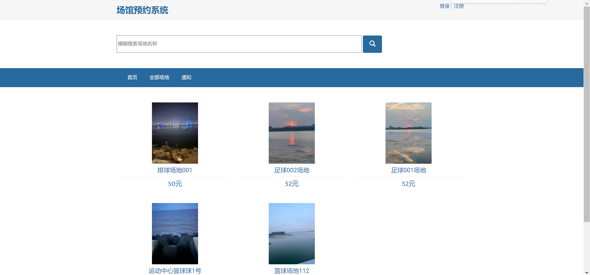
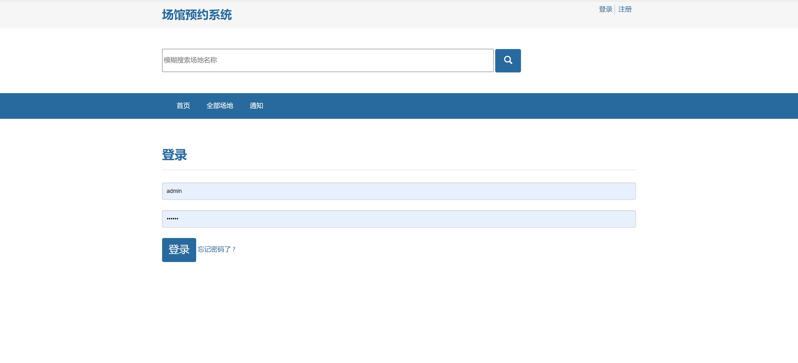
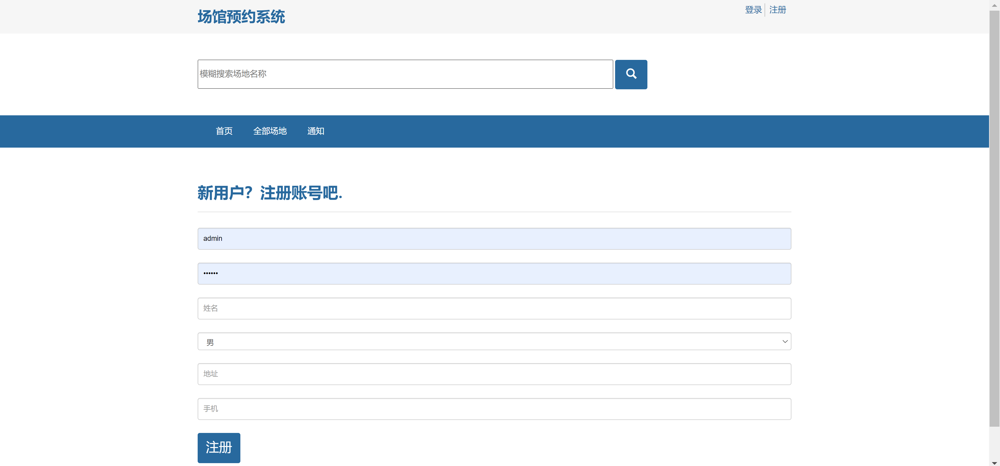
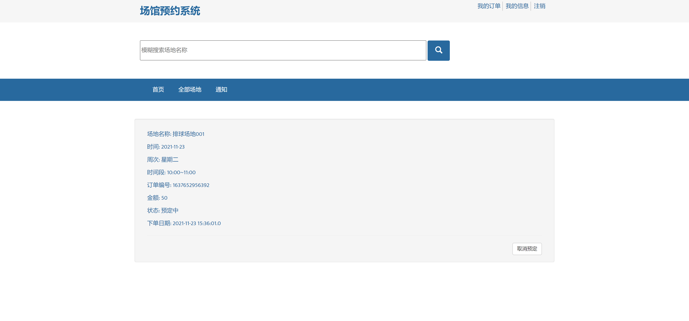
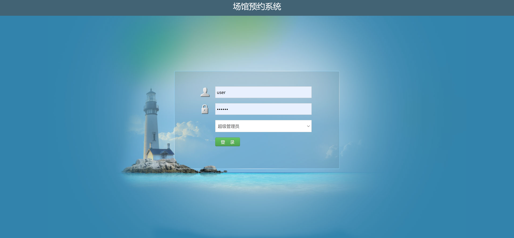
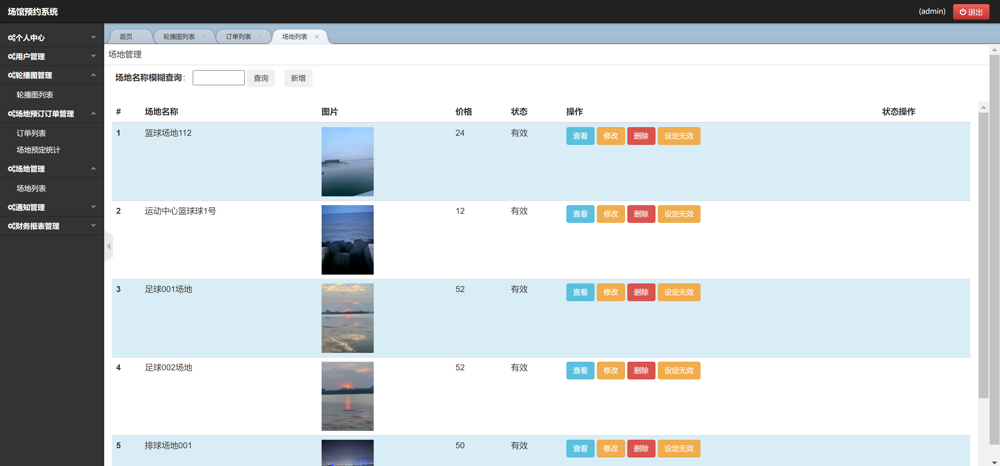

<h1 align="center">场馆预约管理系统</h1>

## 简介
场馆预约管理系统：角色分为管理员和用户；用户登录、场馆浏览、预约申请与管理、用户信息管理；管理员可审核预约、调整场馆开放时间、管理用户权限。    --计算机毕业设计源码；毕设源码；java毕业设计源码

## 联系方式

<h3 align="center">获取完整代码与数据库文件 + 微信：bysj5151 QQ: 86050149 QQ群: 783742310</h3>

<h3 align="center">可帮忙远程部署 包运行成功！提供远程部署、修改代码、设计文档指导、代码讲解等服务！</h3>

## 功能介绍（完整见运行截图）
用户：基本功能包括登录、注册、退出，用户可以通过系统进行场地模糊搜索，浏览不同场馆的使用情况和可用时间，并选择合适的时间段进行预约。用户可以查看和管理自己的预约记录，进行预约的取消或修改，通过个人中心查看与修改个人信息，查询订单，及管理联系地址信息。

管理员：功能包括管理用户登录注册，审核预约申请，调整场馆开放时间，管理用户权限及场地状态设置。管理员可以通过后台管理界面执行新增场地、查看、修改、删除，以及设定场地状态为无效等操作，方便进行系统整体管理及场地的有效预约。

## 运行截图

本代码来源于网络,仅供学习参考使用!

